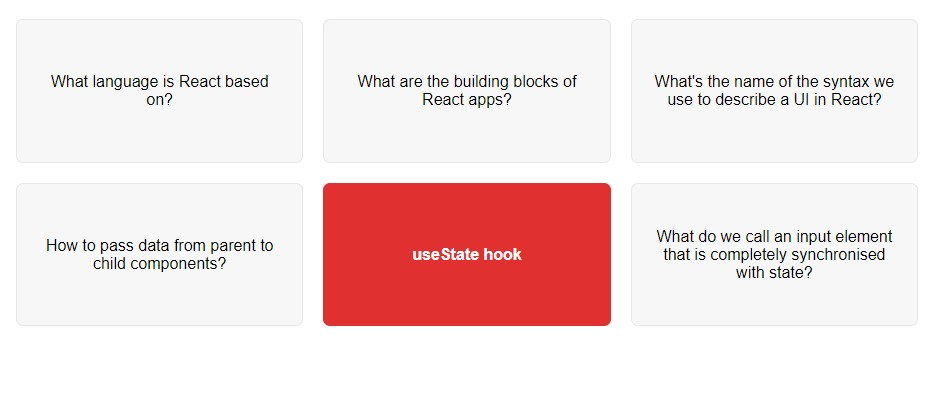

# Date Counter

## Table of contents

- [Overview](#overview)
  - [The challenge](#the-challenge)
  - [Screenshot](#screenshot)
  - [Links](#links)
- [My process](#my-process)
  - [Built with](#built-with)
  - [What I learned](#what-i-learned)
  - [Continued development](#continued-development)
- [Author](#author)

## Overview

### The challenge

Users should be able to:

- View the optimal layout for the app depending on their device's screen size
- When user clicks the question box, its switches to the answer
- When the box is clicked again, it returns to the question

### Screenshot

### Links

- Live Site URL: [View](https://flashcards2.netlify.app/)

## My process

- The FlashCards component manages flashcard rendering and interactivity.
- It uses the useState hook to maintain the selectedId state, which determines the currently selected flashcard.
- The handleClick function toggles the selectedId state when a flashcard is clicked, allowing for the selection and deselection of flashcards.
- Within the component, each flashcard is rendered dynamically using map on the questions array.
- The rendered flashcards display either the question or answer based on whether they are selected (selectedId matches the flashcard's id).

### Built with

- Semantic HTML5 markup
- CSS custom properties
- Mobile-Responsive Design
- JavaScript - Scripting language
- [React](https://reactjs.org/) - JS library

### What I learned

This was a class exercise to learn about useState.

### Continued development

maybe use later

## Author

- Website - [Cameron Howze](https://camkol.github.io/)
- Frontend Mentor - [@camkol](https://www.frontendmentor.io/profile/camkol)
- GitHub- [@camkol](https://github.com/camkol)
- LinkedIn - [@cameron-howze](https://www.linkedin.com/in/cameron-howze-28a646109/)
- E-Mail - [cameronhowze4@outlook.com](mailto:cameronhowze4@outlook.com)
